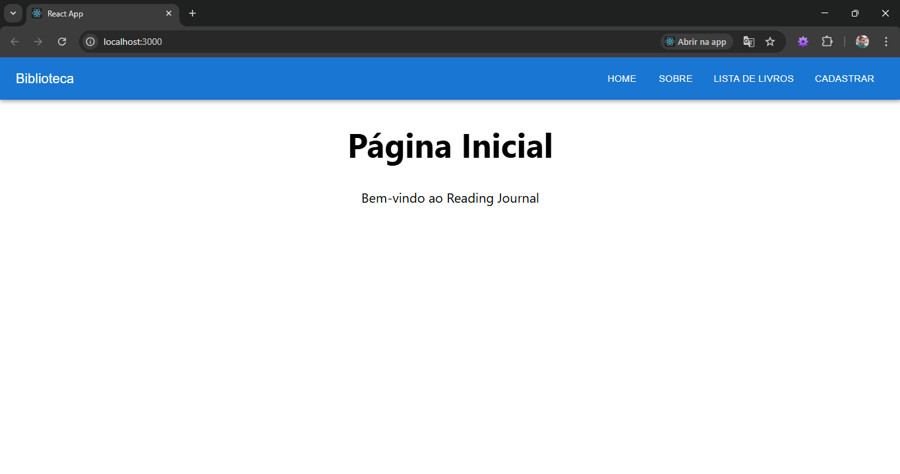
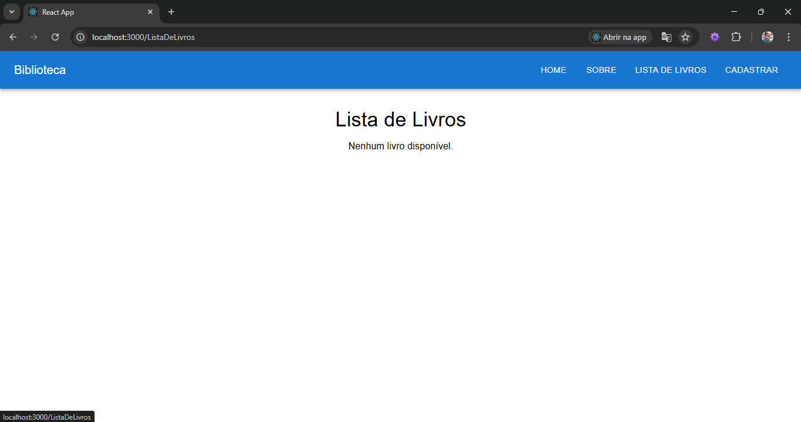
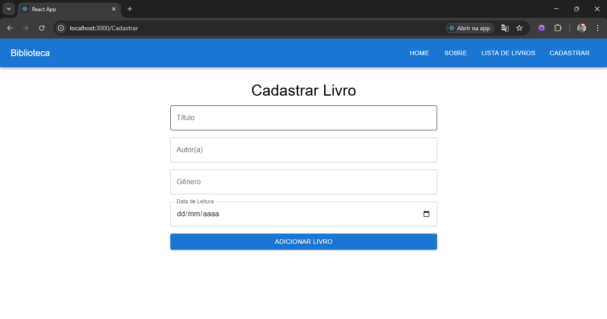

## Nome: `Thomas Prates Rodrigues`

Para executar este projeto:

1. Entre pasta thomas_prates-projeto-fase-2 no terminal:
```
cd thomas_prates-projeto-fase-2
```

2. Rode npm install para instalar as dependências do projeto:


```
npm install
```

3. E em seguida, npm start, para iniciar a execução do projeto.

```
npm start
```

Após execução do projeto, este é o resultado esperado no navegador:


Após execução do projeto, este é o resultado esperado no navegador(lista):


Após execução do projeto, este é o resultado esperado no navegador(cadastro):


## Introdução

Esta é uma aplicação CRUD de um Reading Journal. Este projeto foi elaborado na disciplina Desenvolvimento de Sistemas Frontend do Curso de Graduação Online PUCRS.

## Componentes

Os componentes estão no diretório `./src/components` e eles possuem as seguintes características:
- NavBar:
  - Descrição: este componente serve para navegar pelas "páginas" e componentes criados

- BookList:
  - Descrição: este componente renderiza dados recebido de uma API e contem funções get, delete e put(getBook,deleteBook e editaLivro).

- BookForm:
  - Descrição: este componente renderiza um formulario para cadastrar dados e contem uma função para enviar para uma API (postBook).

Os componentes tem uma váriavel (API_URL) que recebem a url da API("http://localhost:5000/books/").

## Conclusão

Este projeto é a segunda fase do projeto da diciplina de Desenvolvimento de Sistemas Frontend